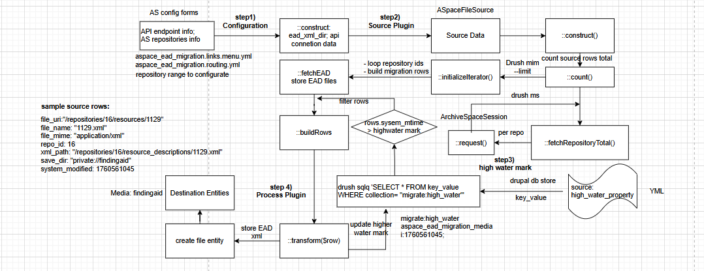

# ArchivesSpace EAD Migration

This module is designed to migrate ArchivesSpace EAD into drupal Media entities with type 'Finding Aid'; The migration also apply a high water mark with the ArchivesSpace resource system latest updated (system_mtime) in Source Plugin within the configuration of the migration's YAML file. The initial migration will process all ArchivesSpace resource records and sets the high water mark value upon completion. When a subsequent migration process is executed, only resources with a `system_mtime` value greater than the stored high water mark will be imported or updated, preventing redundant reprocessing of unchanged records.

## Prerequisites
### Required Drupal Modules
- **Migrate** (`migrate`) – Drupal core migration framework
- **Migrate Plus** (`migrate_plus`) – Extended migration plugins
- **media** (`media`) – Drupal core Media module
- **file** (`file`) – Drupal core File module

### Required Configuration:
- A Drupal **Media type** named `Finding Aid` must exist and be configured before
  running the migration. Create the type following the steps below otherwise:
  - Go to Drupal Site->Administration->Structure->Media types: Add Media types 
    * Name: Finding Aid
    * Media source: File
- Add required fields under 'Manage fields' with the following configurations:
   - field_media_file 
     * Field Storage: Select 'Private files' under 'Upload destination' Option
     * Allowed file extensions: xml
     * File directory: findingaid
   - field_media_of - Entity reference field
- The migration YAML file must define the **high water property** pointing to
  `system_mtime` in the Source Plugin configuration

## Installation and Configuration
1. Install module 'aspace ead migration'
    - Install via composer (`composer require drupal/aspace_ead_migration`)
2. Enable the module via drush or Drupal site
    -  via drush: `drush en -y aspace_ead_migration`
    -  via Drupal site: Go to Extend/Install new module, locate custom module 'locate 'ASpace EAD Migration' and install.
    -   Confirm modules status (`drush pml --type=module --status=enabled | grep migrate_plus`) 
3. Configurate Module Settings
   ASpace ead migration uses ArchivesSpace API endpoint, which must be configured with your ArchivesSpace URL, username, and password. Please visit  `/admin/configuration/ASpace EAD migration configuration settings` in your Drupal site to configure these settings before migration.

## Migration 
1. Use drush to execute migration: `drush mim aspace_ead_migration_media -vv`

## Migration dataflow
   -  
